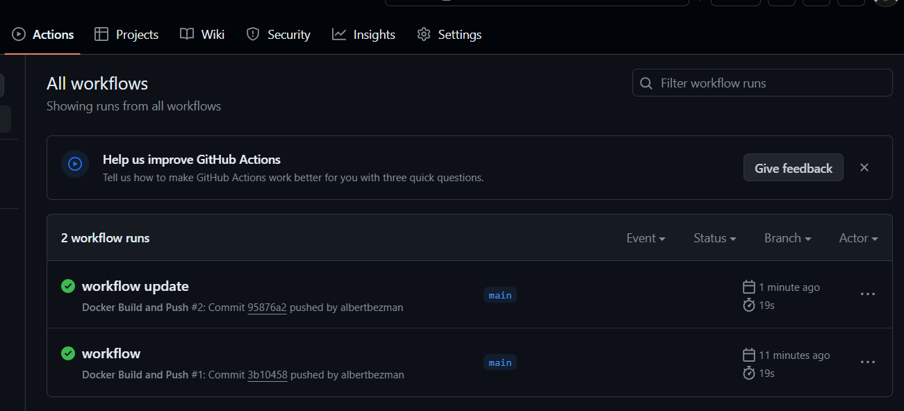

---
# try also 'default' to start simple
theme: frankfurt
author: Albert Bezman
title: Docker
# random image from a curated Unsplash collection by Anthony
# like them? see https://unsplash.com/collections/94734566/slidev
background: https://cover.sli.dev
# some information about your slides, markdown enabled
# title: Welcome to Slidev
info: |
  ## Slidev Starter Template
  Presentation slides for developers.

  Learn more at [Sli.dev](https://sli.dev)
# apply any unocss classes to the current slide
class: text-center
# https://sli.dev/custom/highlighters.html
highlighter: shiki
# https://sli.dev/guide/drawing
drawings:
  persist: false
# slide transition: https://sli.dev/guide/animations#slide-transitions
transition: slide-left
# enable MDC Syntax: https://sli.dev/guide/syntax#mdc-syntax
mdc: true
---

# Docker

### MLX4

<div class="abs-br m-6 flex gap-2">
  <button @click="$slidev.nav.openInEditor()" title="Open in Editor" class="text-xl slidev-icon-btn opacity-50 !border-none !hover:text-white">
    <carbon:edit />
  </button>
  <a href="https://github.com/slidevjs/slidev" target="_blank" alt="GitHub" title="Open in GitHub"
    class="text-xl slidev-icon-btn opacity-50 !border-none !hover:text-white">
    <carbon-logo-github />
  </a>
</div>

<!--
The last comment block of each slide will be treated as slide notes. It will be visible and editable in Presenter Mode along with the slide. [Read more in the docs](https://sli.dev/guide/syntax.html#notes)
-->

---

# What is Docker?

<br>

- **NOT** a virtual machine
- A way to **isolate** processes using Linux kernel features
- A declarative, OS level deployment environment management
- I.e. Reproducible environments for software packages to run in

<br>
<br>


<!--
You can have `style` tag in markdown to override the style for the current page.
Learn more: https://sli.dev/guide/syntax#embedded-styles
-->

<style>
h1 {
  background-color: #2B90B6;
  background-image: linear-gradient(45deg, #4EC5D4 10%, #146b8c 20%);
  background-size: 100%;
  -webkit-background-clip: text;
  -moz-background-clip: text;
  -webkit-text-fill-color: transparent;
  -moz-text-fill-color: transparent;
}
</style>

<!--
Here is another comment.
-->

---

# What problems does it solve?


- Declarative dependency management
- Deployment environment reproducibility + consistency
- Host environment agnostic (so long as Docker engine is accessible)
- Application dependency conflicts
- Deployment + scaling
- Encourages loose coupling
- More efficient than a VM (which has to visualize all hardware)

---

# What is it under the hood?

<br>
Docker utilises a number of Linux kernel features:
<br>

| Feature     | Description                           |
| ----------- | ------------------------------------- |
| `namespaces`| Isolation                             |
| `cgroups`   | Resource management                   |
| `overlayFS` | Filesystem isolation (think 'chroot') |

---

# Namespaces

Linux kernel namespaces allow you to isolate various aspects of your system, like:
- processes `pid`
- network `net`
- ...

Let's make our very own container using namespaces!

<br>

````md magic-move
```sh {*|1|3}
sudo ls -l /proc/1/ns/

ps aux
```

```plaintext
docker/tutorial
❯ ps aux
USER         PID %CPU %MEM    VSZ   RSS TTY      STAT START   TIME COMMAND
root           1  1.6  0.0 167304 12756 ?        Ss   17:14   6:15 /sbin/init
root           2  0.0  0.0   2280  1304 ?        Sl   17:14   0:00 /init
root           6  0.0  0.0   2324   132 ?        Sl   17:14   0:00 plan9 --control-s
root          46  0.0  0.0  48004 15844 ?        S<s  17:14   0:00 /lib/systemd/syst
root          73  0.0  0.0  21972  5868 ?        Ss   17:14   0:02 /lib/systemd/syst
root          84  0.0  0.0   4496   180 ?        Ss   17:14   0:00 snapfuse /var/lib
```

```sh {*|2|4|}
# Lets isolate some processes
sudo unshare --fork --pid --mount-proc bash

ps aux
```

```plaintext
.../docker/tutorial# ps aux
USER         PID %CPU %MEM    VSZ   RSS TTY      STAT START   TIME COMMAND
root           1  0.0  0.0   5048  3876 pts/15   S    23:28   0:00 bash
root           8  0.0  0.0   7484  3280 pts/15   R+   23:28   0:00 ps aux
```

```sh
exit
```

```sh
ip a
```

```plaintext
...
2: eth0: <BROADCAST,MULTICAST,UP,LOWER_UP> mtu 1500 qdisc mq state UP group default qlen 1000
    link/ether 00:15:5d:83:03:57 brd ff:ff:ff:ff:ff:ff
    inet 172.24.143.239/20 brd 172.24.143.255 scope global eth0
```

```sh
# Let's isolate some network resources
sudo ip netns add mynetns
sudo ip netns exec mynetns bash
```

```sh
ip a
```

```plaintext
1: lo: <LOOPBACK> mtu 65536 qdisc noop state DOWN group default qlen 1000
    link/loopback 00:00:00:00:00:00 brd 00:00:00:00:00:00
```

```sh {*|1|3}
exit

sudo ip netns del mynetns
```

````

---

# Cgroups

Cgroups are a way to control how much resources your isolated processes take up (CPU, RAM, ...)

````md magic-move
```sh
# Prerequisites
sudo apt-get update
sudo apt-get install cgroup-tools
```

```sh
sudo cgcreate -g cpu:/example_group
```

```sh
sudo cgset -r cpu.cfs_quota_us=20000 example_group
sudo cgset -r cpu.cfs_period_us=100000 example_group
```

```sh
sudo cgexec -g cpu:/example_group yes > /dev/null &
```

```sh
top
```

<arrow v-click="[4, 5]" x1="350" y1="310" x2="195" y2="334" color="#953" width="2" arrowSize="1" />

```plaintext {*|2}
    PID USER      PR  NI    VIRT    RES    SHR S  %CPU  %MEM     TIME+ COMMAND
 146461 root      20   0    3208    988    900 R  19.7   0.0   0:03.57 yes
```

```sh {*|1|3}
sudo ps aux | grep '[y]es' | awk '{print $2}' | xargs kill

sudo cgdelete -g cpu:/example_group
```

````

<br>
<div v-click>
Process never exceeds 20% of CPU!
</div>

---

# OverlayFS

Allows multiple file system layers to be overlaid and presented as a single file system.

OverlayFS enables filesystem sharing that allows multiple containers to share the same base image while maintaining their own file system changes in seperate layers.

Let's demonstrate this:

````md magic-move
```sh
# Prepare directories
sudo mkdir /overlayfs
sudo mkdir /overlayfs/lower
sudo mkdir /overlayfs/upper
sudo mkdir /overlayfs/work
sudo mkdir /overlayfs/mount
```

```sh
echo "Hello from the lower layer" | sudo tee /overlayfs/lower/hello.txt
```

```sh
sudo mount -t overlay overlay -o lowerdir=/overlayfs/lower,upperdir=/overlayfs/upper,workdir=/overlayfs/work /overlayfs/mount
```

```sh
cat /overlayfs/mount/hello.txt
```

```sh
echo "Hello from the upper layer" | sudo tee /overlayfs/mount/upper_hello.txt
```

```sh
ls /overlayfs/upper/
```

```sh
sudo umount /overlayfs/mount
sudo rm -r /overlayfs
```

````

<br>
<div v-click>
Changes made in the overlay filesystem are written to the upper layer, making it easy to track changes or revert to the original state without modifying the original data. This functionality is key in scenarios like container runtime environments where you need to maintain base image integrity while allowing changes during runtime.
</div>

---

# Congratulations!

## You've just built Docker (sort of ...)

<br>


---

# Components

Docker composed of:

### 1. Docker Engine 
  <br>a) Daemon (can be remote) `dockerd`
  <br>   Listens for API requests and manages Docker objects such as containers
  <br>b) Client (can connect to remote server) e.g. `docker exec`
  <br>   Control Docker via API calls


---

# Components (continued)

### 2. Images
  <br>- A read-only (immutable) template composed of layered FS which contains all dependencies required to build a container
  <br>- An image is a read-only layer that is never modified, all changes are made in top-most writeable layer
  <br>- Built from ‘base’ image


<div v-click>

### 3. Containers
  <br> - Runnable, isolated instances of images
  <br> - When you launch a container from an image, a writeable layer is added on top of this image
  <br> - A set of linux namespaces with a limited view of the system
</div>

---

# Components (continued)

### 4. Docker registry
  <br> - Where Docker can source images from
  <br> - Can be public (e.g. Docker Hub https://hub.docker.com/)
  <br> - Can be private (e.g. your companies image registry)

<div v-click>

### 5. Docker-compose
  <br> - A way to combine containers and configure them (via `docker-compose.yml`)
</div>

<div v-click>

### 6. Docker Swarm
  <br> - Container orchestration for clusters
</div>

---

# Practical 

Prerequisites

1. Install Docker engine
<br>a) For Linux: https://docs.docker.com/engine/install/linux-install/
<br>b) For Windows: https://docs.docker.com/desktop/install/windows-install/
<br>c) For Mac: https://docs.docker.com/desktop/install/mac-install/

<br>
Either download Docker for your distribution if on Linux via a package manager (e.g. `apt install`), or download the desktop app for Mac/Windows. This will install docker engine and requisite tooling.

<br>
<br>

2. Sign up for docker hub: https://hub.docker.com/signup

---

# Practical

Basic workflow


1. Define your image via `Dockerfile` or `docker-compose.yml`.
<br>

2. Build the container via `docker build`
<br>

3. Run the container via `docker run`
<br>

4. Update the image, build, run, deploy

---

# Practical

Let's define a basic image and build it!


````md magic-move
```sh {2|3|4}
# Prepare directories
cd some-directory
mkdir docker_tut_1
cd docker_tut_1
```

```sh
# Create Dockerfile
touch Dockerfile
vim Dockerfile # OR open with your favourite editor
```

```docker
# Use an official base image from the Docker Hub
FROM ubuntu:latest

CMD ["echo", "Hello, Docker!"]
```


```sh
# Build your first image
docker build -t my-first-image . # -t flag tags the image with a label
```

````

<div v-click>
<br>
Let's now see that our container is available to `dockerd` locally:

```sh
docker images
```
</div>

<div v-click>

```plaintext
REPOSITORY       TAG       IMAGE ID       CREATED       SIZE
my-first-image   latest    f39894e3a078   7 days ago    77.9MB
```
</div>

<div v-click>
<br>
Can check the GUI app under 'images' section too.
</div>

---

# Practical

Let's run it!

````md magic-move
```sh
docker run my-first-image
```
```plaintext
$ docker run my-first-image
Hello, Docker!
```
````

<div v-click>
<br>
Let's see our container status

```sh
docker ps -a
```
</div>

<div v-click>

```plaintext
CONTAINER ID   IMAGE            COMMAND                  CREATED         STATUS                        PORTS                      NAMES
021f5244985c   my-first-image   "echo 'Hello, Docker…"   3 minutes ago   Exited (0) 3 minutes ago                                 friendly_snyder
```
</div>

<div v-click>
<br>
Can check the GUI app under 'containers' section too.
</div>

---

# Practical

How do we update our image?

Dockerfiles composed of statements e.g. `FROM`, `RUN` ...
<br>
<br>Let's add a 'RUN' statement
<br>RUN executes a command in an FS layer. Each layer builds on the previous one.

````md magic-move
```docker
# Use an official base image from the Docker Hub
FROM ubuntu:latest

CMD ["echo", "Hello, Docker!"]
```

```docker {*|4}
# Use an official base image from the Docker Hub
FROM ubuntu:latest

RUN apt-get update && apt-get install -y curl

# Optional: Command to run when the container starts
CMD ["echo", "Hello, Docker!"]
```

```docker {*|6}
# Use an official base image from the Docker Hub
FROM ubuntu:latest

RUN apt-get update && apt-get install -y curl
# We can add as many RUN commands as we need
RUN apt-get install -y python3 python3-pip

# Optional: Command to run when the container starts
CMD ["echo", "Hello, Docker!"]
```
````

---

# Practical

`CMD` command is the entrypoint for all docker containers.
<br>There can only be 1 `CMD` in each Dockerfile.
<br>Let's modify our `CMD` statement to do something else.

````md magic-move
```docker
# Use an official base image from the Docker Hub
FROM ubuntu:latest

RUN apt-get update && apt-get install -y curl
# We can add as many RUN commands as we need
RUN apt-get install -y python3 python3-pip

# Optional: Command to run when the container starts
CMD ["echo", "Hello, Docker!"]
```


```docker {*|9}
# Use an official base image from the Docker Hub
FROM ubuntu:latest

RUN apt-get update && apt-get install -y curl
# We can add as many RUN commands as we need
RUN apt-get install -y python3 python3-pip

# Optional: Command to run when the container starts
CMD ["python3", "-c", "print('Hello World')"]
```
````

<v-click>

Let's test the changes:

````md magic-move

```sh
docker build -t my-first-image .
docker run my-first-image
```

```plaintext
=> [2/3] RUN apt-get update && apt-get install -y curl
=> [3/3] RUN apt-get install -y python3 python3-pip
```

```plaintext
docker run my-first-image
Hello World
```

````

</v-click>

---

# Practical

Hmmm, but what happened to our old image and container?
<br>
<br>
Let's check that with:

````md magic-move
```sh
docker images
```

```plaintext
REPOSITORY       TAG       IMAGE ID       CREATED          SIZE
my-first-image   latest    484411e8476f   21 minutes ago   480MB
<none>           <none>    f39894e3a078   7 days ago       77.9MB
```

```sh
docker ps -a
```

```plaintext
CONTAINER ID   IMAGE            COMMAND                  CREATED          STATUS                           PORTS                      NAMES
a43ccf28841a   my-first-image   "python3 -c 'print('…"   21 minutes ago   Exited (0) 21 minutes ago                                   vigilant_bouman
021f5244985c   f39894e3a078     "echo 'Hello, Docker…"   53 minutes ago   Exited (0) 53 minutes ago                                   friendly_snyder
```

````

<v-click>

The old image and containers still exist! We must clean them up.

````md magic-move
```sh
# For containers, can use:
docker rm container_name_or_id
# OR
docker run --rm container_name # --rm flag removes the container after it finishes running (for dev)
# Don't delete images and containers if you're planning to deploy them!
```

```sh
# For images
docker rmi image_name
# OR
docker image prune # removes all dangling images
```

```sh
# For both
docker system prune -a --volumes # Be careful! This removes all images and containers that are stopped!
```
````

</v-click>

---

# Practical

Let's set an environment variable via the `ENV` command.

````md magic-move

```docker
# Use an official base image from the Docker Hub
FROM ubuntu:latest

RUN apt-get update && apt-get install -y curl
# We can add as many RUN commands as we need
RUN apt-get install -y python3 python3-pip

# Optional: Command to run when the container starts
CMD ["python3", "-c", "print('Hello World')"]
```

```docker {*|8}
# Use an official base image from the Docker Hub
FROM ubuntu:latest

RUN apt-get update && apt-get install -y curl
# We can add as many RUN commands as we need
RUN apt-get install -y python3 python3-pip

ENV APP_HOME /app

# Optional: Command to run when the container starts
CMD ["python3", "-c", "print('Hello World')"]
```
````

---

# Practical

Let's copy some files from host to container via the `COPY` command and set a working directory via `WORKDIR`.

```sh
echo "print('Hello World')" > hw.py
```

<br>

<v-click>

````md magic-move

```docker
# Use an official base image from the Docker Hub
FROM ubuntu:latest

RUN apt-get update && apt-get install -y curl
# We can add as many RUN commands as we need
RUN apt-get install -y python3 python3-pip

ENV APP_HOME /app

# Optional: Command to run when the container starts
CMD ["python3", "-c", "print('Hello World')"]
```

```docker {*|10-15}
# Use an official base image from the Docker Hub
FROM ubuntu:latest

RUN apt-get update && apt-get install -y curl
# We can add as many RUN commands as we need
RUN apt-get install -y python3 python3-pip

ENV APP_HOME /app

COPY ./hw.py /app/hw.py

WORKDIR /app

# Optional: Command to run when the container starts
CMD ["python3", "hw.py"]
```

```sh
docker build -t my-first-image .
docker run --rm my-first-image
docker image prune
```

````

</v-click>

<v-click>

More Dockerfile commands at: https://docs.docker.com/reference/dockerfile/
</v-click>

---

# Practical

Let's integrate several containers together using `docker-compose.yml`.
<br>
We'll use this to build an container API and make it talk to a database container (MongoDB) in part 2 of this pres.

````md magic-move
```sh
cd ..
mkdir docker_tut_2
cd docker_tut_2
```

```sh
touch docker-compose.yml
```

```yml
#docker-compose.yml
version: '3.9'

services:
  app:
    image: python:3.10
    volumes:
      - ./app:/usr/src/app
    working_dir: /usr/src/app
    command: python app.py
    environment:
      - MONGO_URI=mongodb://mongo:27017/
    depends_on:
      - mongo
    ports:
      - "5000:5000"
#...
```

```yml
#...
  mongo:
    image: mongo:latest
    volumes:
      - mongo-data:/data/db

volumes:
  mongo-data:
```

```sh
mkdir app
sh
echo "from flask import Flask, request, jsonify\nimport pymongo\napp = Flask(__name__)\nclient = pymongo.MongoClient('mongodb://mongo:27017/')\ndb = client.testdb\n@app.route('/')\ndef hello():\n    return 'Hello from Flask and MongoDB!'\nif __name__ == '__main__':\n    app.run(host='0.0.0.0', port=5000)" > app/app.py
```

```sh
docker-compose up
```

````

---

# Practical

How can you debug issues in your container?
<br>

```sh
# Enter the container
docker exec -it mycontainer bash
```

<br>

```sh
# See logs
docker logs --tail 20 mycontainer
```
---

# Continuing the tutorial

To follow along with the slides and get code snippets:

https://github.com/albertbezman/docker-tutorial/blob/main/slides.md

---

# Docker Compose

## What?

1) Used to define multi-container Docker configurations
2) All configuration for multiple containers stored in single `docker-compose.yml` file
3) Run all services defined in compose file with `docker-compose up`

<br>

<v-click>

## Why?

1) Makes managing multi-container setups more manageable
2) Also manage some configuration options e.g. ports and environment variables from compose file

</v-click>

---

# Practical: Docker-Compose

Let's integrate several containers together using `docker-compose.yml`.
<br>
<br>
We'll use this to build an container API and make it talk to a database container (MongoDB) in part 2 of this tutorial.

```sh
cd ${tutorial_directory}
mkdir docker_tut_2
cd docker_tut_2
```

```sh
touch docker-compose.yml
```

---

# Practical: Docker-Compose

Let's define a basic api.

````md magic-move

```sh
mkdir app
touch app/api.py

pip install flask
```

```python
# app/api.py
from flask import Flask, jsonify

app = Flask(__name__)

@app.route('/')
def home():
    return jsonify({'message': 'Hello, world!', 'status': 'success'})

if __name__ == '__main__':
    app.run(debug=True)
```

```sh
# Test it's working
python3 app/api.py

# In a new terminal
curl http://127.0.0.1:3000
```

```sh
# Test it's working
{
  "message": "Hello, world!",
  "status": "success"
}
```

````

---

# Practical: Docker-Compose

Let's edit our `docker-compose.yml` file and create a python image.

````md magic-move

```yml
#docker-compose.yml
version: '3.9'

services:
  api:
    image: python:3.10
    working_dir: /usr/src/app
    command: python app.py
```

```sh
docker-compose up
```


````

<v-click>
Oh no, we get an error! 🥲

```plaintext
docker_tut_2-api-1  | python: can't open file '/usr/src/app/app.py': [Errno 2] No such file or directory
docker_tut_2-api-1 exited with code 2
```
</v-click>

---

# Practical: Docker-Compose

Using the `build` keyword.

````md magic-move

```yml
#docker-compose.yml 
version: '3.9'

services:
  api:
    image: python:3.10
    working_dir: /usr/src/app
    command: python app.py
```

```sh
mkdir ./flask
touch ./flask/Dockerfile
```

```yml {*|6}
#docker-compose.yml 
version: '3.9'

services:
  api:
    build: ./flask #directory where Dockerfile is
```

```docker
# Dockerfile
FROM python:3.10

COPY ./app /api

WORKDIR /api

CMD ["python3", "api.py"]
```

```plaintext
 => ERROR [api 3/3] COPY ./app ./api                                           0.0s
 ...
"/app": not found
```

```yml {*|6-8}
#docker-compose.yml 
version: '3.9'

services:
  api:
    build:
      context: .  # Set the context to the parent directory
      dockerfile: ./flask/Dockerfile
```

```plaintext
# Different error!
...
docker_tut_2-api-1  | ModuleNotFoundError: No module named 'flask'
...
```
````

---

# Practical: Docker-Compose

Let's try and diagnose the problem a different way.

We can enter an image's filesystem and run commands using `docker run --rm -it`

````md magic-move

```sh
docker run --rm -it ${image_name} bash

python3

>>> import flask
```

```plaintext
Traceback (most recent call last):
  File "<stdin>", line 1, in <module>
ModuleNotFoundError: No module named 'flask'
```

````

<br>
<br>

<v-click>
So it's an imports issue!
</v-click>


---

# Practical: Docker-Compose

Let's solve our dependency issue by creating a `.venv` and also installing any packages.

````md magic-move

```sh
python3 -m venv .venv
source .venv/bin/activate

pip install flask
```

```sh
pip3 freeze > requirements.txt # or pip freeze
```

```docker
# ./flask/Dockerfile
FROM python:3.10

WORKDIR /api

RUN python3 -m venv .venv

ENV PATH="/api/.venv/bin:$PATH"

COPY requirements.txt ./
RUN pip install --no-cache-dir -r requirements.txt

COPY ./app /api/app

CMD ["python3", "app/api.py"]
```

```sh
docker-compose build --no-cache
docker-compose up
```

```plaintext
# success!
docker_tut_2-api-1  |  * Serving Flask app 'api'
docker_tut_2-api-1  |  * Debug mode: on
```

````

---

# Practical: Docker-Compose

Don't forget to expose your container's ports!

````md magic-move

```sh
# Let's test the api again
curl localhost:3000
```

```plaintext
curl: (7) Failed to connect to 127.0.0.1 port 3000 after 0 ms: Connection refused
```

```yml {*|8-9}
version: '3.9'

services:
  api:
    build:
      context: .
      dockerfile: ./flask/Dockerfile
    ports:
      - "3000:3000"
```

```sh
docker-compose up
```

```sh
curl localhost:3000
```

```plaintext
{
  "message": "Hello, world!",
  "status": "success"
}
```

````

---

# Practical: Docker-Compose

But what happens if we want to make a change to our source code, do we have to rebuild the container?
<br>

Not if we use a volume!

````md magic-move

```yml {*|8-9}
version: '3.9'

services:
  api:
    build:
      context: .
      dockerfile: ./flask/Dockerfile
    volumes:
      - ./app:/api/app  # Mount the local './app' directory to '/app' in the container
    ports:
      - "3000:3000"
```

```
docker-compose build
docker-compose up
```

```python
#app/api.py
from flask import Flask, jsonify

app = Flask(__name__)


@app.route("/")
def home():
    return jsonify({"message": "Hello, World!", "status": "success"})


if __name__ == "__main__":
    app.run(host='0.0.0.0', port=3000, debug=True)
```

```python {*|9}
#app/api.py
from flask import Flask, jsonify

app = Flask(__name__)


@app.route("/")
def home():
    return jsonify({"message": "Hello, MLX!", "status": "success"})


if __name__ == "__main__":
    app.run(host='0.0.0.0', port=3000, debug=True)
```


```sh
curl localhost:3000
```

```plaintext
{
  "message": "Hello, MLX!",
  "status": "success"
}
```

````

---

# Practical: Docker-Compose

Let's add another container to our `docker-compose.yml` configuration.

````md magic-move

```yml {*|6-9}
version: '3.9'

services:
  api:
    #...
  db:
    image: mongo:latest
    ports:
      - "27017:27017"
```

```sh
pip3 install pymongo

pip3 freeze > requirements.txt
```

```python {*|3-12}
#app/api.py
from flask import Flask, jsonify
from pymongo import MongoClient

client = MongoClient('localhost', 27017)

db = client['local']

collection = db['test']

item = {"name": "test", "value": "Hello MLX4!"}
collection.insert_one(item)

app = Flask(__name__)


@app.route("/")
def home():
    return jsonify({"message": "Hello, MLX!", "status": "success"})


if __name__ == "__main__":
    app.run(host='0.0.0.0', port=3000, debug=True)
```

```sh
docker-compose up --build
```

```plaintext
# Error, api.py can't reach mongodb 🤔
docker_tut_2-api-1  | pymongo.errors.ServerSelectionTimeoutError: localhost:27017: [Errno 111] Connection refused (configured timeouts: socketTimeoutMS: 20000.0ms, connectTimeoutMS: 20000.0ms), Timeout: 30s, Topology Description: <TopologyDescription id: 662ad4798c76864cb4d41940, topology_type: Unknown, servers: [<ServerDescription ('localhost', 27017) server_type: Unknown, rtt: None, error=AutoReconnect('localhost:27017: [Errno 111] Connection refused (configured timeouts: socketTimeoutMS: 20000.0ms, connectTimeoutMS: 20000.0ms)')>]>
docker_tut_2-api-1 exited with code 1
```

````

---

# Practical: Docker-Compose

Let's allow the python api to reach the docker container by adding an environment variable in `docker-compose.yml`.

````md magic-move

```yml {*|12-15}
version: '3.9'

services:
  api:
    build:
      context: .
      dockerfile: ./flask/Dockerfile
    volumes:
      - ./app:/api/app  # Ensure this path matches the path used inside your Dockerfile
    ports:
      - "3000:3000"
    depends_on:
      - db
    environment:
      - MONGO_HOST=db  # Define environment variable for MongoDB host

  db:
    #...
```

```python {*|3-6}
from flask import Flask, jsonify
from pymongo import MongoClient
import os

# Use an environment variable for the MongoDB host
mongo_host = os.getenv('MONGO_HOST', 'localhost')
client = MongoClient(mongo_host, 27017)

db = client['local']
collection = db['test']

item = {"name": "test", "value": "Hello MLX4!"}
collection.insert_one(item)

app = Flask(__name__)

# ...
```

```python {*|4-5}
# ...
@app.route("/")
def home():
    item = collection.find_one({"name": "test"})
    return jsonify({"message": item['value'], "status": "success"})

if __name__ == "__main__":
    app.run(host='0.0.0.0', port=3000, debug=True)

```

```
docker-compose up --build
```

```sh
curl localhost:3000
```

```plaintext
{
  "message": "Hello MLX4!",
  "status": "success"
}
```

````

---

# Practical: CI/CD

### Prerequisites

Let's learn how to build an image using GitHub Actions and push it to the Docker Hub registry.

1) Sign up to the Docker hub on: https://hub.docker.com/

2) Create a new empty repository on GitHub

3) Create an empty Docker Hub repository via: https://hub.docker.com/repository/create

---

# Practical: CI/CD

Let's begin by creating a Dockerfile and pushing it to GitHub.

````md magic-move

```sh
cd ${docker_tutorial_directory}
mkdir docker_tut_3
cd docker_tut_3

touch Dockerfile

git init
git add -A
git commit -m 'initial commit'

# Optionally
git branch -m master main
```

```sh
git remote add origin https://github.com/albertbezman/docker-tut.git
git branch -M main
git push -u origin main
```

````

---

# Practical: CI/CD

Let's add something to our Dockerfile.

````md magic-move

```docker
FROM python:3.10

CMD ["python3", "-c", "print('Hello World')"]
```

```sh
git add -A
git commit -m 'Dockerfile'
git push
```

````

---

# Practical: CI/CD

### Configure GitHub

1) Go to your-repo/settings

2) Find 'Secrets and variables'

3) Add two new variables under: Actions > Repository Secrets

```
DOCKER_USERNAME
DOCKER_PASSWORD
```

---

# Practical: CI/CD

### Adding the Github Actions workflow.

````md magic-move

```sh
mkdir -p .github/workflows
touch .github/workflows/docker-build.yml
```

```yml
# docker-build.yml
name: Docker Build and Push

on:
  push:
    branches:
      - main  # Set this to the branch you want to trigger the workflow

jobs:
  build-and-push:
    runs-on: ubuntu-latest
    steps:
    - name: Check Out Repo
      uses: actions/checkout@v2
# ...
```

```yml
# docker-build.yml
# ...
    - name: Set up Docker Buildx
      uses: docker/setup-buildx-action@v1

    - name: Login to DockerHub
      uses: docker/login-action@v1
      with:
        username: ${{ secrets.DOCKER_USERNAME }}
        password: ${{ secrets.DOCKER_PASSWORD }}

    - name: Build and push Docker image
      uses: docker/build-push-action@v2
      with:
        push: true
        tags: yourusername/yourrepository:latest  # Change 'yourusername/yourrepository' to your Docker Hub repo

    - name: Logout from DockerHub
      if: always()
      run: docker logout
```
````

---

# Practical: CI/CD

Let's check it out on GitHub actions.

```
git add -A
git commit -m 'workflow'
git push
```

<br>

<v-click>

1) Go to your GitHub Repo

2) Find the 'Actions' tab

3) Click into your new workflow

4) Check out the new image you've pushed on Docker Hub

</v-click>

---

# Practical: CI/CD

Let's make a change to our Dockerfile and see how we can achieve CI/CD.

````md magic-move

```docker
FROM python:3.10

CMD ["python3", "-c", "print('Hello World')"]
```

```docker {*|3}
FROM python:3.10

CMD ["python3", "-c", "print('Hello MLX!')"]
```

```sh
git add -A
git commit -m 'workflow update'
git push
```

````

<v-click>

Check it out on GitHub Actions and Docker Hub.

</v-click>

---

# Workflow Runs on GitHub Actions



---

# The End 🐋

Author: [github.com/albertbezman](https://github.com/albertbezman)